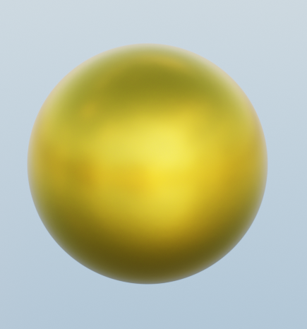
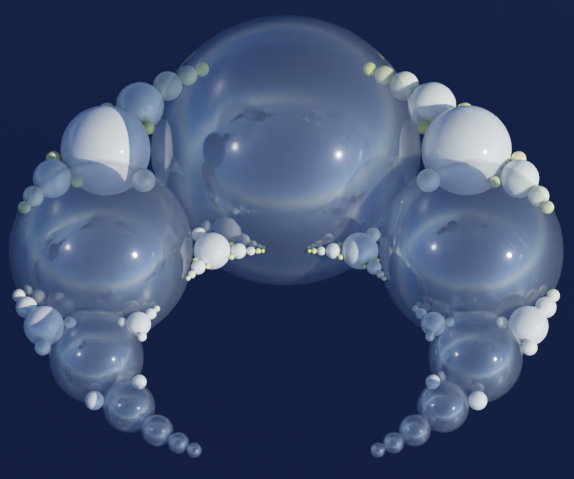

Here is a list of examples that are added in the example folder: 
<b> A simple sphere</b> 

 

<code> sphere = Sphere(location=[0, 0, 0], radius=10,color="gold",smooth=3)</code> 

<b> MultiSphere </b> 

 

Once you cloned the repository, you need to install the bpy library. 
This is what worked for me: 
<b>Linux</b> 
 
activate your virtual environment (you should most conveniently use the python distributed with your blender installation) 
source venv/bin/activate.fish  (sorry, I use fish terminals) 
 
Then you can just run 
pip install python-dev-tools
pip install bpy 
pip install mathutils 
 
and the current bpy-wheels downloaded and bpy and mathutils are installed 
 
<b>Windows</b> 
create a virtual environment (use the python distributed with you latest blender installation) 
Then you can just run 
pip install bpy 
pip install mathutils 
 
On Windows: You need to install the Visual C++ Build Tools and then install the python development package using pip 
pip install --upgrade setuptools 
pip install --upgrade wheel 
pip install --upgrade python-dev-tools (only works with pip 22.3) 
