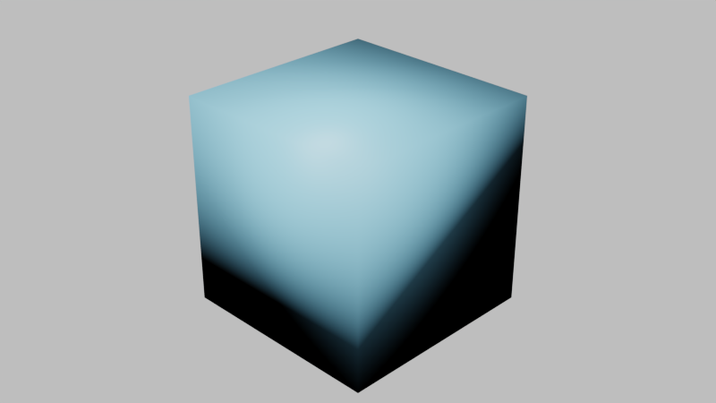
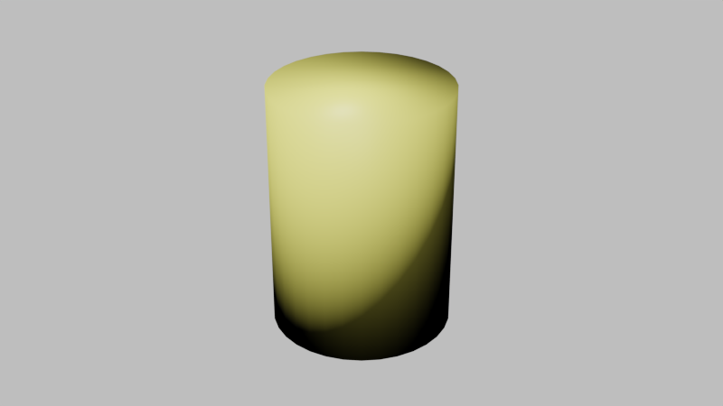
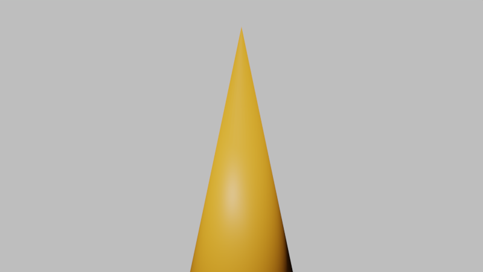
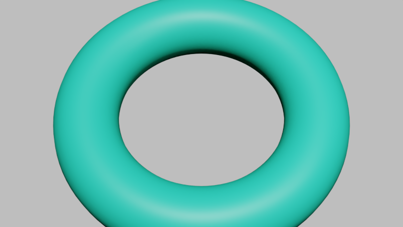
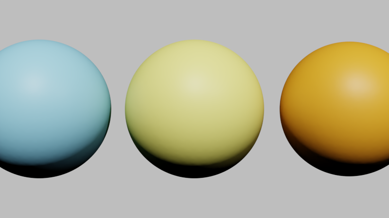
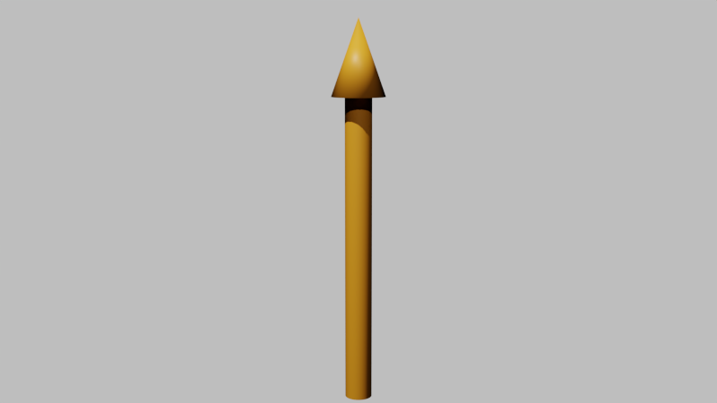

# Object gallery

Reference renders for the basic geometric objects in `objects/`, produced by
the scenes in [`examples/example_more_objects.py`](../example_more_objects.py)
(a self-contained companion to `example_objects.py`).

Each scene sets up a tiny studio — a camera aimed with `set_camera_view_to`,
the default sun that `initialize_blender` adds, plus one fill point light —
then creates a single coloured object and animates it in. No external HDRI
or data files are required, so every scene builds and renders anywhere.

All images below were rendered headless with **Blender 5.0.1**, Cycles on the
GPU (OPTIX), 96 samples, 800×450, at the frame where the grow/appear
animation has settled.

---

## Cube — `objects/cube.py`



```python
from objects.cube import Cube

cube = Cube(location=[0, 0, 0], color="drawing", name="DemoCube")
cube.grow(begin_time=0, transition_time=1)      # scales up from the center
```

`Cube` wraps a unit cube primitive. `grow` (inherited from `BObject`) makes it
appear by animating its scale from `0`.

---

## Cylinder — `objects/cylinder.py`



```python
from objects.cylinder import Cylinder

cyl = Cylinder(location=[0, 0, 0], length=2.2, radius=0.8,
               color="example", name="DemoCylinder")
cyl.grow(begin_time=0, transition_time=1)
```

`Cylinder` accepts `length` and `radius` (or a `start`/`end` pair via
`Cylinder.from_start_to_end`).

---

## Cone — `objects/cone.py`



```python
from objects.cone import Cone

cone = Cone(location=[0, 0, -1], length=2.5, radius=1.0,
            color="important", name="DemoCone")
cone.grow(begin_time=0, transition_time=1)      # NB: Cone.grow returns None
```

`Cone` is a tapered primitive scaled by `[radius, radius, length]`. Note its
`grow` does not return the end time (unlike `BObject.grow`), so advance your
timeline manually.

---

## Torus — `objects/torus.py`



```python
from objects.torus import Torus

torus = Torus(location=[0, 0, 0], rotation_euler=(0.4, 0, 0),
              major_segments=96, minor_segments=24,
              major_radius=1.6, minor_radius=0.45,
              color="joker", name="DemoTorus")
torus.appear(begin_time=0, transition_time=1)
```

`Torus` exposes the `major_radius`/`minor_radius` and segment counts of
Blender's torus primitive.

---

## Spheres — `objects/geometry/sphere.py`



```python
from objects.geometry.sphere import Sphere

for x, color in zip([-2.2, 0, 2.2], ["drawing", "example", "important"]):
    s = Sphere(location=[x, 0, 0], radius=0.9, color=color, smooth=3)
    s.grow(begin_time=0, transition_time=1)
```

`Sphere` (used heavily in `example_objects.py`) takes a `radius`, a `color`,
and a `smooth` subdivision level. Here three are staggered to show the colour
palette (`drawing`, `example`, `important`).

---

## Arrow — `objects/arrow.py`



```python
from objects.arrow import Arrow

arrow = Arrow.from_start_to_end(start=[0, 0, -1.6], end=[0, 0, 1.8],
                                radius=0.12, color="important",
                                name="DemoArrow")
arrow.grow(begin_time=0, transition_time=1.2)
```

`Arrow` is a composite (stem `Cylinder` + tip `Cone`). The
`from_start_to_end` constructor orients it between two points, which is the
most convenient way to place one.

---

## Reproducing these renders

The scenes are ordinary `Scene` sub-scenes. To rebuild a single one
interactively:

```bash
cd <repo root>
python examples/example_more_objects.py        # then pick a scene by number
```

To build **and render** every scene headless to `images/` (what produced the
pictures above), use the bundled runner with the project's Blender:

```bash
blender -b --python examples/object_gallery/render_gallery.py -- \
    examples.example_more_objects ExamplesMoreObjects \
    examples/object_gallery/images 96 800 450
#   └ module ──────────────────┘ └ class ──────────┘ └ out dir ─────┘ samples W H
```

The runner builds each sub-scene (saving an `ExamplesMoreObjects_<name>.blend`
to `media/blend/`), enables the GPU (OPTIX → CUDA fallback), and renders the
settled frame of each to `<out dir>/<scene>.png`.

> **One-time setup note:** `initialize_blender` loads a frame-rate preset from
> `files/blend/presets/framerate/<FRAME_RATE>.py`. If that file is missing,
> create it (for `QUALITY='final'`, `FRAME_RATE` is `60`):
> ```python
> # files/blend/presets/framerate/60.py
> import bpy
> bpy.context.scene.render.fps = 60
> bpy.context.scene.render.fps_base = 1.0
> ```
